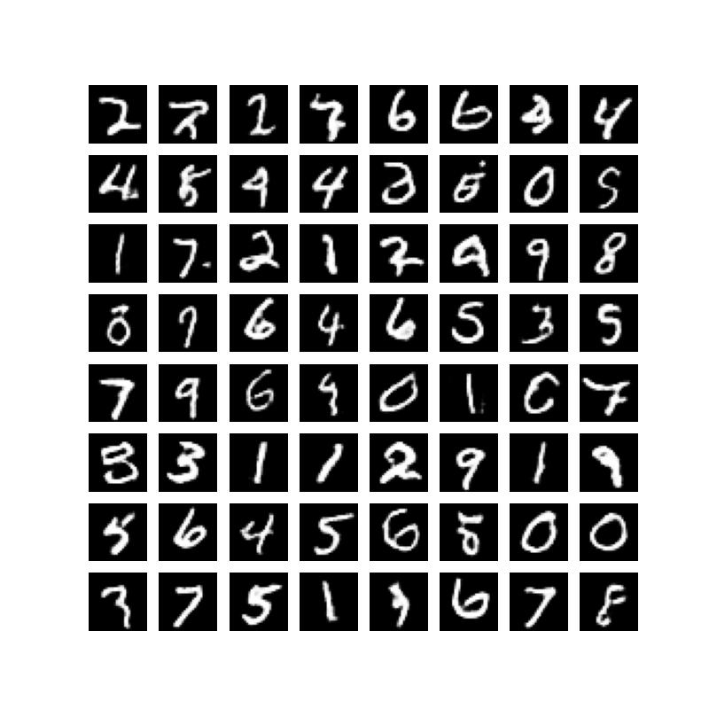

# VQ-VAE

* The following is an implementation based on the paper "Discrete neural representation by Van Den oord"
* We have done many experiments to get the thing working, only the final details are included in this file

## Training Datset
* MNIST Dataset
* CIfar10(Soon)

## Architecture Details
### Codebook
 *Codebook size 10x10
 *Codebook feature dimension 32
### VAE-Encoder
  * 2 convolutions of size 2x2 with stride 2
  * One Residual block with 2 conv of size 3x3 with padding 1,stride 1 to maintain spatial dimension. Group norm after addition
  * Silu Activation used throughout inspired by diffusion models
### VAE Decoder
  * Residual block with same specs
  * Same architecture as of Encoder with conv block replaced with conv Transpose to upsample
### Priot
  * Causal_transformer is used a prior to do autoregressive modelling on latent codes
  * emb_dim=128,no_heads=8,causal_decoder_block=3

## Inference
* We take a zero vector of size (B,49)
* Initalize 1st token as a special token 100
* We autoregressively generate one latent at a time (i+1th pixel is generated at ith run)
* Doing this proccess for 49 times generates the required latent
* Latent is passed through decoder to get the image

## Psuedocode(Training)
* Image is trained for reconstruction from paper as mentioned in the paer
* We encode the image into a feature dimension of 32x7x7
* We replace the encoded features with nearest neighbours in the codebook
* Decoder decodes the image from this codes. We use straight through gradient estimator to do the backprop through this operation
* Loss function is given by MSE loss on input and output image, MSE loss on distance of codes from the encoded feature vectors.Some details are left out that can be checked in the paper
* Once the reconstruction is loss enough we train causal_transformer to generate latents in autoregressive fashion
  

## Training Details
* Trained for 20 epochs on 3090 GPU both for reconstruction and autoregressive task

## Mask Details
* Raster scan mask(Same as Transformers), the current pixel can look at only previous pixel, enforces autoregressive property
* The masking is done in the raster scan order 

## Samples Generated
 
 
## Future changes/work

